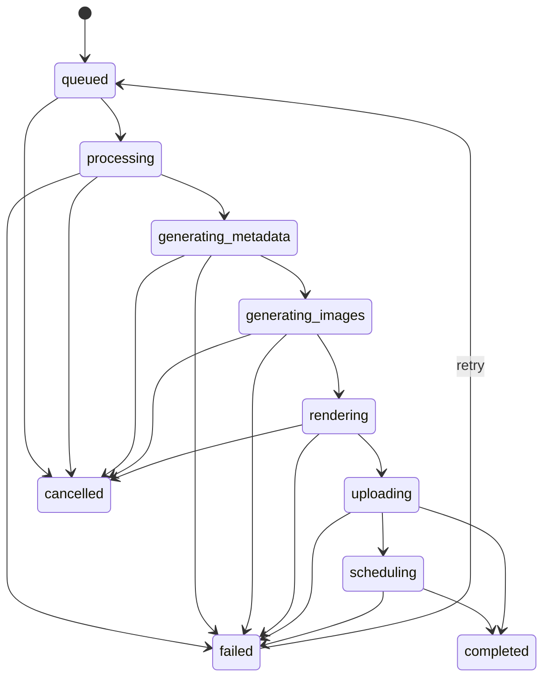

# Re-Master durable job queue architecture

Status: proposed architecture only. No schema or worker was implemented in this branch.

## Goals

- Return a job ID immediately when Freddy starts a video production.
- Continue work when the browser tab closes or an SSE connection breaks.
- Persist step progress, errors, outputs, and retry state server-side.
- Prevent duplicate YouTube uploads.
- Support retry from the last safe step and cancel before irreversible steps.
- Keep Re-Master using the existing RealtyFlow Supabase project `ereapsfcsqtdmzosgnnn`.

## Recommended job model

Use the existing `public.pipeline_runs` concept if review approves an additive repair, because production already has the table and it is empty. If drift makes that unsafe, create a new purpose-specific table in a separate reviewed migration.

Minimum columns for a repaired or replacement job table:

| Column | Purpose |
| --- | --- |
| `id uuid` | Stable job ID returned to Re-Master. |
| `brand text` | `remasterfreddy` for new jobs; keep reading `neuralbeat` during transition where needed. |
| `song_id text` | Existing `songs.id`. |
| `song_name text` | Snapshot for admin readability. |
| `status text` | Durable lifecycle status. |
| `current_step text` | Current executor step. |
| `progress integer` | 0-100 coarse progress. |
| `retry_count integer` | Attempts already made. |
| `max_retries integer` | Configurable retry cap. |
| `error_code text` | Machine-readable error. |
| `error_message text` | Safe, redacted user-visible message. |
| `input_config jsonb` | Song and pipeline options. |
| `selected_images jsonb` | Slideshow image URLs and IDs where available. |
| `logo_url text` | Selected logo. |
| `thumbnail_url text` | Custom thumbnail, if any. |
| `publishing_settings jsonb` | immediate/auto/manual, publishAt, language flags. |
| `output_config jsonb` | Renderer outputs, metadata snapshot, thumbnail variants. |
| `output_video_url text` | Optional stored/rendered video URL if introduced. |
| `youtube_video_id text` | Set immediately after YouTube returns an ID. |
| `youtube_url text` | Public video URL. |
| `idempotency_key text` | Derived from brand + song + input config + approved metadata version. |
| `lease_owner text` | Worker that currently owns the job. |
| `lease_expires_at timestamptz` | Prevents two workers processing the same job. |
| `heartbeat_at timestamptz` | Last executor heartbeat. |
| `created_at timestamptz` | Creation time. |
| `started_at timestamptz` | First processing start. |
| `completed_at timestamptz` | Terminal completion/cancel/failure. |
| `updated_at timestamptz` | Last mutation. |

Recommended separate log table:

| Column | Purpose |
| --- | --- |
| `id uuid` | Log row ID. |
| `job_id uuid` | Parent job. |
| `step text` | Step name. |
| `level text` | `info`, `warn`, `error`. |
| `event text` | `step_started`, `step_completed`, `retry_scheduled`, etc. |
| `message text` | Safe diagnostic. |
| `details jsonb` | Redacted structured context. |
| `created_at timestamptz` | Log time. |

## Status model

Minimum statuses:

```text
queued
processing
generating_metadata
generating_images
rendering
uploading
scheduling
completed
failed
cancelled
```

Recommended transitions:



Cancellation should be blocked or converted to a follow-up state after `youtube_video_id` exists unless the system can prove what external side effects happened.

## Lease and heartbeat

Worker claim algorithm:

1. Select one queued or retryable failed job where no lease exists or `lease_expires_at < now()`.
2. Update it in one atomic statement with `lease_owner`, `lease_expires_at`, `heartbeat_at`, and `status`.
3. Worker heartbeats every 10-30 seconds.
4. If heartbeat expires, another worker may claim the job only from a safe checkpoint.

Never let two workers upload the same job to YouTube. The worker must re-read the job row before entering `uploading`.

## Idempotency

Create an `idempotency_key` from:

```text
brand
song_id
audio_url or audio hash
approved metadata version
selected image IDs/URLs
logo URL
thumbnail URL
publishing settings
```

Rules:

- Reject or return the existing active job when the same idempotency key is already `queued`, `processing`, `rendering`, `uploading`, or `scheduling`.
- Allow a new job only after explicit user choice when a previous job is `completed`.
- If `youtube_video_id` is set, retry must not call YouTube `videos.insert` again.
- Persist `youtube_video_id` immediately after YouTube returns it, before thumbnail, playlist, or song finalization steps.

## API contracts

### Create job

```http
POST /api/neural-beat/jobs
```

Request:

```json
{
  "recordId": "song-id",
  "customImageUrls": [],
  "logoUrl": null,
  "customThumbnailUrl": null,
  "autoSchedule": false,
  "customPublishAt": null,
  "multilingualDescription": true
}
```

Response:

```json
{
  "jobId": "uuid",
  "status": "queued",
  "existing": false
}
```

### Get job status

```http
GET /api/neural-beat/jobs/:jobId
```

Response:

```json
{
  "jobId": "uuid",
  "status": "rendering",
  "currentStep": "Render Video with FFmpeg",
  "progress": 62,
  "retryCount": 0,
  "youtubeVideoId": null,
  "youtubeUrl": null,
  "error": null,
  "updatedAt": "2026-06-07T12:00:00.000Z"
}
```

### Stream job events

```http
GET /api/neural-beat/jobs/:jobId/events
```

SSE becomes a convenience view over persisted job/log rows, not the owner of the work.

### Retry job

```http
POST /api/neural-beat/jobs/:jobId/retry
```

Allowed only when:

- status is `failed`
- retry count is below max
- the last completed checkpoint is safe to resume
- if `youtube_video_id` exists, retry resumes after upload rather than uploading again

### Cancel job

```http
POST /api/neural-beat/jobs/:jobId/cancel
```

Allowed while queued or before external irreversible side effects. After upload starts, cancellation should mark a manual follow-up unless YouTube state is known and safe.

## Worker model

Preferred:

- dedicated long-running worker/runtime for FFmpeg and YouTube upload
- process one job at a time per worker
- pull/lease jobs from Supabase
- write heartbeat and step logs
- upload final artifacts before YouTube when useful for resume/debugging

Acceptable interim:

- a protected manual executor endpoint that processes one leased job, with a hard time budget and safe checkpointing
- Vercel Cron can trigger the executor, but the job must not depend on one request finishing

Avoid:

- browser-owned jobs
- multiple songs in one HTTP invocation
- retrying a whole pipeline after a partial YouTube upload without checking `youtube_video_id`

## Security model

- Re-Master browser authenticates as Freddy.
- Re-Master proxy verifies Supabase session and user email.
- RealtyFlow job APIs require the existing Re-Master migration secret or a stronger server-to-server auth mechanism.
- YouTube upload must require the verified `remasterfreddy` brand token.
- `SUPABASE_SERVICE_ROLE_KEY` stays server-only.
- Safe diagnostics must redact OAuth tokens, service-role keys, signed upload tokens, and connection strings.

## Schema proposal

PR 1 should decide between:

1. additive repair of `public.pipeline_runs`
2. new `public.remaster_pipeline_jobs` + `public.remaster_pipeline_job_logs`

Given production `pipeline_runs` is empty but drifted from `src/lib/supabase/schema.sql`, the safer long-term option is a new purpose-specific Re-Master table unless migration review strongly prefers reusing `pipeline_runs`.

Any migration must be:

- additive
- idempotent
- RLS-enabled
- service-route-only initially
- explicit about rollback
- tested against empty and partial schemas

## PR breakdown

1. Schema/job model only.
2. Server API for create/status/log retrieval.
3. Executor/worker that can process one leased job.
4. Re-Master UI status/history view.
5. Retry/cancel controls.
6. Replace current `/api/neural-beat` request-owned execution with job creation + status polling/SSE.
7. Optional child jobs for Shorts and thumbnail A/B rotation.

## Open decisions

- Whether to reuse empty `pipeline_runs` or create `remaster_pipeline_jobs`.
- Which runtime will host FFmpeg for longer videos.
- Whether rendered MP4 should be stored in Supabase Storage before YouTube upload.
- How long completed job logs are retained.
- Whether automatic cron processing remains disabled until manual job execution is stable.
